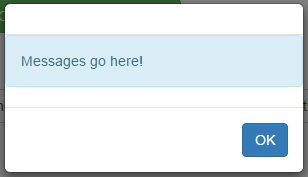
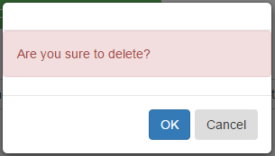

# Angular-EasyModal-alert-confirm

This easyModal can be used in AngularJS-base web applications, which is an alternative of JS alert and  
confirm dialog with enhanced functionality(html template,css,callback and passed in arguments,external controller),  
more flexible, better user experience.

##Dependencies
Requires AngularJS v1.4.0+ and Bootstrap's CSS.

## Overview


### Alert Example
```
    emodal.alert("Messages go here!");
```
You will get the following modal:  


### Confirm Example
```
           emodal.confirm("Are you sure to delete?",
               function(){
                   $scope.data='You have clicked OK!';
               },
               function(){
                   $scope.data='You have clicked Cancel!';
               }
           );
        };
```           
You will get the following modal:  


### Modal Example      
```
        emodal.modal("../partials/externalTemplate.html",
                {
                title:'Callback Function',
                okCallback:okCallbackFun,
                okArgs:{id:1},
                cancelCallback:cancelCallbackFun,
                cancelArgs:{info:'some text'}
               });
        var okCallbackFun = function (arg) {
            $scope.data = '[ok callback] Parameter: '+arg.id;
        };
        var cancelCallbackFun = function (arg) {
            $scope.data = '[cancel callback] Parameter: '+arg.info;
        };                 
```        
You will get the following modal:  

           
## [Live Usage Examples](http://jsfiddle.net/ttf177/2y7q9nnm/23/) 

## [Documentation and samples](http://regisluo.github.io/angular-easymodal/)

## License

 It is available under the [MIT license](http://www.opensource.org/licenses/mit-license.php).

